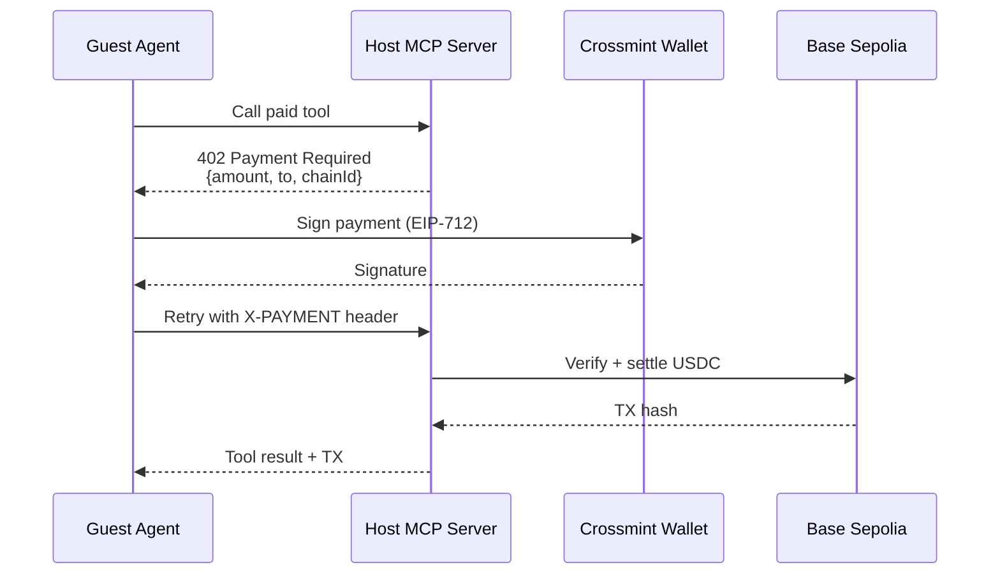
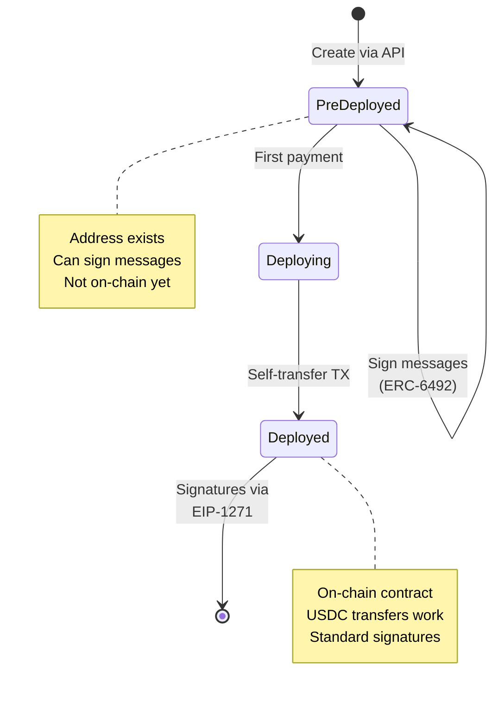

# Event RSVP MCP: Paid AI Tools with Autonomous Agent Payments

A production-ready reference implementation showing how AI agents can autonomously pay for MCP tool calls using smart wallets and the x402 payment protocol.

**What makes this different:** Real on-chain USDC payments on Base, autonomous agent-to-agent transactions, and production-grade multi-tenant architecture—no mocks, no simulations, no toy examples.

## Why This Matters

You're building an MCP server and want to monetize it. Traditional approaches require:
- Manual payment flows that break agent autonomy
- Private key management (security nightmare)
- Custom payment infrastructure
- User intervention for every transaction

**This demo shows a better way:**

```
User: "RSVP to event abc-123"
  ↓
Guest Agent: Detects paid tool, checks price ($0.05)
  ↓
Guest Agent: Signs USDC payment autonomously
  ↓
Host Agent: Verifies signature, settles on Base
  ↓
Guest Agent: "You're registered! TX: 0xabc...def"
```

**Zero user intervention** after initial confirmation. The agent handles everything: signature generation, payment submission, transaction verification, error recovery.

---

## Quick Start

```bash
# 1. Install dependencies
npm install

# 2. Get API keys
# - Crossmint Console: https://www.crossmint.com/console
# - OpenAI Platform: https://platform.openai.com/api-keys

# 3. Configure environment
cp .dev.vars.example .dev.vars
# Edit .dev.vars:
#   CROSSMINT_API_KEY=sk_...
#   OPENAI_API_KEY=sk-...

# 4. Run locally
npm run dev
```

Visit `http://localhost:5173` to see the chat interface.

### Your First Autonomous Payment

1. **Connect the agents**
   - Click "Connect to Events" in the chat
   - Guest agent establishes MCP connection to Host

2. **Create an event** (as host)
   - Go to `http://localhost:5173/?view=my-mcp`
   - Sign in with email OTP
   - Create an event with a price (e.g., $0.05)

3. **Get testnet USDC**
   - Copy the Guest wallet address from chat
   - Visit [Circle Faucet](https://faucet.circle.com/)
   - Select "Base Sepolia" and paste address
   - Mint 1 USDC

4. **Watch autonomous payment**
   - Say: `rsvp to event <event-id>`
   - Guest agent detects 402 response
   - Confirms payment with user
   - Signs and submits USDC transfer
   - Retries MCP call with payment proof
   - Displays TX hash and confirmation

**No MetaMask. No private keys. No manual signing.** Just HTTP and smart contracts.

---

## What You're Building: Core Technologies

This demo combines four production technologies to enable autonomous agent payments:

### 1. Paid MCP Tools (x402 Protocol)

MCP (Model Context Protocol) tools are functions that agents can call. The x402 protocol adds payment requirements:

```typescript
// src/agents/host.ts - Define a paid tool
this.server.paidTool(
  "rsvpToEvent",           // Tool name
  "RSVP to a paid event",  // Description
  0.05,                    // Price in USD
  { eventId: z.string() }, // Input schema
  {},                      // Output schema
  async ({ eventId }) => {
    // Your business logic
    const event = await getEvent(eventId);
    await recordRsvp(eventId, guestWallet);
    return { success: true, event };
  }
);
```

**What happens when called:**

```
1. Guest Agent: "Call rsvpToEvent(eventId='abc-123')"
   ↓
2. Host Agent: HTTP 402 Payment Required
   {
     "payment": {
       "amount": "50000",  // 0.05 USDC (6 decimals)
       "currency": "USDC",
       "to": "0x123...",
       "chainId": 84532
     }
   }
   ↓
3. Guest Agent: Signs payment with smart wallet
   ↓
4. Guest Agent: Retries with header: X-PAYMENT: <signature>
   ↓
5. Host Agent: Verifies signature → Settles on-chain → Executes tool
   ↓
6. Guest Agent: Receives result + TX hash
```

**Key insight:** The `402` status code (reserved since HTTP/1.1 in 1997) finally has a use case. Payment requirements are just HTTP headers.

### 2. x402: HTTP-Native Payments

x402 makes the `402 Payment Required` status code work for real transactions:

```typescript
// src/agents/guest.ts - Auto-handle 402 responses
const server = new McpServer({ ... })
  .withX402Client({
    wallet: crossmintWallet,
    onPaymentRequired: async (requirement, retryFn) => {
      // Confirm with user
      const approved = await askUser(`Pay ${requirement.amount} USD?`);
      if (!approved) return;

      // Sign payment (EIP-712 typed data)
      const signature = await wallet.signPayment(requirement);

      // Retry request with proof
      return retryFn(signature);
    }
  });
```

**Payment flow:**



**Key insight:** Payments are just HTTP retries with cryptographic proofs. No WebSockets, no polling, no custom protocols.

### 3. Cloudflare Durable Objects: Stateful Agents

Normal serverless functions (AWS Lambda, Cloudflare Workers) are stateless—great for APIs, terrible for agents that need to maintain conversation state, MCP connections, and payment history.

**Durable Objects are:**
- **Single-threaded** - No race conditions, guaranteed serial execution
- **Stateful** - In-memory state persists across requests
- **Globally unique** - Only ONE instance per ID worldwide
- **Auto-scaling** - Created on-demand, hibernate when idle

```typescript
// src/agents/host.ts
export class Host extends DurableObject {
  private wallet: CrossmintWallet;
  private server: McpServer;

  constructor(ctx: DurableObjectState, env: Env) {
    super(ctx, env);
    // Initialize once, persists across requests
    this.wallet = await createHostWallet(env);
    this.server = new McpServer({ ... });
  }

  async fetch(request: Request) {
    // All requests to /mcp/users/abc-123 hit THIS instance
    return this.server.handleRequest(request);
  }
}
```

**Per-user isolation:**

```
User A → /mcp/users/hash-a → Host DO (name: "hash-a")
                               ├─ wallet: 0xAAA...
                               ├─ events: [...]
                               └─ revenue: $12.50

User B → /mcp/users/hash-b → Host DO (name: "hash-b")
                               ├─ wallet: 0xBBB...
                               ├─ events: [...]
                               └─ revenue: $8.00
```

Each user gets:
- Their own DO instance (stateful mini-server)
- Isolated wallet and payment history
- Scoped KV storage (`hash-a:events:*`)
- Independent MCP server

**Why not regular Workers?**

| Need | Regular Worker | Durable Object |
|------|---------------|----------------|
| MCP connection state | ❌ Lost between requests | ✅ Persists in memory |
| WebSocket support | ❌ No state | ✅ Built-in |
| Coordination | ❌ Race conditions | ✅ Single-threaded |
| Per-user isolation | ❌ Shared instance | ✅ Unique per ID |

**Key insight:** Durable Objects are "mini-servers per user" that never have concurrency bugs. Perfect for stateful agent protocols like MCP.

### 4. Crossmint Smart Wallets: No Private Keys

Traditional wallets require managing private keys—terrible UX, security nightmare, non-starter for autonomous agents.

**Crossmint smart wallets:**
- Controlled via API (server-side) or email OTP (client-side)
- ERC-4337 compliant smart contract accounts
- Work **before** on-chain deployment (ERC-6492 signatures)
- Auto-deploy on first transaction
- Validate signatures via EIP-1271

```typescript
// src/agents/host.ts - Create wallet from API key
const wallet = CrossmintWalletService.from({
  apiKey: env.CROSSMINT_API_KEY,
  chain: "base-sepolia"
});

// Sign payment (works even if wallet not deployed yet!)
const signature = await wallet.signTypedData({
  domain: { chainId: 84532, ... },
  types: { Payment: [...] },
  primaryType: "Payment",
  message: { amount: "50000", to: "0x123...", ... }
});
```

**Smart wallet lifecycle:**



**ERC-6492 vs EIP-1271:**

| Stage | Standard | How It Works |
|-------|----------|--------------|
| **Pre-deployed** | ERC-6492 | Signature includes deployment bytecode. Verifiers simulate deployment, check signature against simulated contract. |
| **Deployed** | EIP-1271 | Standard smart contract signature validation. Contract's `isValidSignature()` verifies. |

**Key insight:** Smart wallets can sign transactions before they exist on-chain. No deployment costs until first real transaction.

---

## Architecture Overview

```
┌─────────────────────────────────────────────────────────────┐
│  Browser (React UI)                                         │
│  • Chat interface for user commands                         │
│  • WebSocket connection to Guest Agent                      │
│  • Payment confirmation modal                               │
└─────────────────────┬───────────────────────────────────────┘
                      │ WebSocket
                      ↓
┌─────────────────────────────────────────────────────────────┐
│  Cloudflare Worker (Gateway)                                │
│  • Route: /agent → Guest Agent DO                           │
│  • Route: /mcp/users/{id} → Host Agent DO                   │
│  • Route: /api/* → KV operations                            │
└─────────────────────┬──────────────┬────────────────────────┘
                      │              │
         ┌────────────┘              └────────────┐
         ↓                                        ↓
┌──────────────────────┐              ┌──────────────────────┐
│  Guest Agent DO      │◄─────MCP────►│  Host Agent DO       │
│  (name: "default")   │   Protocol   │  (name: userId hash) │
│                      │              │                      │
│  • WebSocket server  │              │  • MCP server        │
│  • Crossmint wallet  │              │  • Paid tools        │
│  • Payment signer    │              │  • Event storage     │
│  • Shared instance   │              │  • Per-user instance │
└──────────────────────┘              └─────────┬────────────┘
         │                                      │
         │                                      ↓
         │                            ┌──────────────────────┐
         │                            │  Cloudflare KV       │
         │                            │  • users:{email}     │
         │                            │  • {hash}:events:*   │
         │                            │  • {hash}:revenue    │
         │                            └──────────────────────┘
         │
         └──────────────┬─────────────────────────────────────┐
                        ↓                                     ↓
              ┌───────────────────┐              ┌──────────────────────┐
              │  Crossmint API    │              │  Base Sepolia        │
              │  • Wallet mgmt    │              │  • USDC settlement   │
              │  • Signature API  │              │  • TX verification   │
              └───────────────────┘              └──────────────────────┘
```

**Data flow for paid RSVP:**

1. User types: `rsvp to event abc-123`
2. Browser → WebSocket → Guest Agent DO
3. Guest Agent → MCP call → Host Agent DO
4. Host Agent → 402 Payment Required
5. Guest Agent → Ask user confirmation
6. Guest Agent → Crossmint API (sign payment)
7. Guest Agent → MCP retry with X-PAYMENT header
8. Host Agent → x402 facilitator (verify signature)
9. x402 facilitator → Base Sepolia (settle USDC)
10. Host Agent → KV (record RSVP + increment revenue)
11. Host Agent → Guest Agent (result + TX hash)
12. Guest Agent → Browser (display confirmation)

---

## How It Works: Payment Verification Deep Dive

The most critical piece is how the Host Agent verifies payments are real before executing paid tools.

### Step 1: Return Payment Requirement

```typescript
// src/agents/host.ts
this.server.paidTool("rsvpToEvent", "...", 0.05, schema, {}, async (args) => {
  // Before this handler runs, the MCP server checks for payment
  // If no valid X-PAYMENT header, returns:

  return {
    statusCode: 402,
    body: {
      payment: {
        amount: "50000",              // 0.05 USDC (6 decimals)
        currency: "USDC",
        to: this.wallet.address,      // Host's wallet
        chainId: 84532,               // Base Sepolia
        facilitator: X402_FACILITATOR_URL
      }
    }
  };
});
```

### Step 2: Guest Signs Payment

```typescript
// src/agents/guest.ts - Automatically triggered by 402 response
async onPaymentRequired(requirement: PaymentRequirement) {
  // 1. Show modal to user
  const approved = await this.confirmPayment(requirement);
  if (!approved) throw new Error("Payment declined");

  // 2. Sign EIP-712 typed data
  const signature = await this.wallet.signTypedData({
    domain: {
      name: "x402 Payment",
      version: "1",
      chainId: requirement.chainId,
    },
    types: {
      Payment: [
        { name: "amount", type: "uint256" },
        { name: "currency", type: "address" },
        { name: "to", type: "address" },
        { name: "nonce", type: "uint256" },
      ]
    },
    primaryType: "Payment",
    message: {
      amount: requirement.amount,
      currency: USDC_ADDRESS,
      to: requirement.to,
      nonce: Date.now(), // Simple nonce for demo
    }
  });

  // 3. Return signature for retry
  return signature;
}
```

**Key insight:** EIP-712 signatures are human-readable in MetaMask/WalletConnect. Users see exactly what they're signing, not a random hex string.

### Step 3: Host Verifies & Settles

```typescript
// src/agents/host.ts - Called by MCP server before executing tool
async verifyPayment(signature: string, requirement: PaymentRequirement) {
  // 1. Reconstruct signed message
  const message = {
    amount: requirement.amount,
    currency: USDC_ADDRESS,
    to: this.wallet.address,
    nonce: requirement.nonce,
  };

  // 2. Verify signature via x402 facilitator
  const response = await fetch(X402_FACILITATOR_URL + "/verify", {
    method: "POST",
    body: JSON.stringify({
      signature,
      message,
      signer: guestWalletAddress,
    })
  });

  if (!response.ok) throw new Error("Invalid signature");

  // 3. Submit for settlement (USDC transfer on Base)
  const { txHash } = await response.json();

  // 4. Record revenue
  await this.env.KV.put(
    `${this.userId}:revenue`,
    (currentRevenue + requirement.amount).toString()
  );

  return { verified: true, txHash };
}
```

**Facilitator responsibilities:**
- Verify signature matches message
- Check signer has USDC balance
- Submit transaction to Base Sepolia
- Return TX hash for tracking

**Key insight:** The facilitator is a trusted third party that handles blockchain interaction. In production, you'd run your own or use a decentralized alternative.

---

## Code Walkthrough: Building Your Own Paid MCP

### File Structure

```
events-concierge/
├── src/
│   ├── agents/
│   │   ├── host.ts          # MCP server with paid tools (300 LOC)
│   │   └── guest.ts         # MCP client with auto-payment (200 LOC)
│   │
│   ├── shared/
│   │   └── eventService.ts  # KV operations for events (150 LOC)
│   │
│   ├── utils/
│   │   ├── cors.ts          # CORS headers for MCP
│   │   └── hashing.ts       # User ID → URL-safe hash
│   │
│   ├── x402Adapter.ts       # Crossmint → viem wallet adapter (100 LOC)
│   ├── server.ts            # Cloudflare Worker entry point (200 LOC)
│   ├── client.tsx           # React UI (optional for demo)
│   └── constants.ts         # Chain config, addresses
│
├── wrangler.toml            # Durable Object bindings
└── package.json
```

### Host Agent: Exposing Paid Tools

**Location:** `src/agents/host.ts:45-120`

```typescript
export class Host extends DurableObject {
  private wallet: CrossmintWallet;
  private server: McpServer;
  private userId: string;

  constructor(ctx: DurableObjectState, env: Env) {
    super(ctx, env);

    // Extract user ID from Durable Object name (e.g., "hash-abc123")
    this.userId = ctx.id.toString();

    // Create wallet from API key (server-side, no user interaction)
    this.wallet = await CrossmintWalletService.from({
      apiKey: env.CROSSMINT_API_KEY,
      chain: "base-sepolia"
    });

    // Initialize MCP server with x402 support
    this.server = new McpServer({
      name: `Event Host for ${this.userId}`,
      version: "1.0.0"
    })
      .withX402({
        wallet: this.wallet,
        facilitator: X402_FACILITATOR_URL,
        usdcAddress: USDC_ADDRESS,
        chainId: BASE_SEPOLIA_CHAIN_ID,
      });

    this.registerTools();
  }

  private registerTools() {
    // FREE tool: List events
    this.server.tool(
      "listEvents",
      "List all events created by this host",
      {},
      {},
      async () => {
        const events = await listEvents(this.env.KV, this.userId);
        return { events };
      }
    );

    // PAID tool: RSVP to event ($0.05)
    this.server.paidTool(
      "rsvpToEvent",
      "RSVP to an event (requires payment)",
      0.05,  // Price in USD
      { eventId: z.string() },
      {},
      async ({ eventId }, paymentTx: string) => {
        // Only executed if payment verified!

        const event = await getEvent(this.env.KV, this.userId, eventId);
        if (!event) throw new Error("Event not found");

        // Record RSVP
        await recordRsvp(this.env.KV, this.userId, eventId, {
          guestWallet: paymentTx.from,  // From TX details
          paidAmount: "50000",
          txHash: paymentTx.hash,
          timestamp: Date.now()
        });

        // Increment revenue counter
        const revenueKey = `${this.userId}:revenue`;
        const currentRevenue = parseInt(await this.env.KV.get(revenueKey) || "0");
        await this.env.KV.put(revenueKey, (currentRevenue + 50000).toString());

        return {
          success: true,
          event,
          transactionHash: paymentTx.hash,
          message: `RSVP confirmed! Paid ${event.price} USDC.`
        };
      }
    );

    // PAID tool: Get event analytics ($0.01)
    this.server.paidTool(
      "getEventAnalytics",
      "Get detailed analytics for an event",
      0.01,
      { eventId: z.string() },
      {},
      async ({ eventId }) => {
        const rsvps = await getRsvps(this.env.KV, this.userId, eventId);
        const revenue = rsvps.reduce((sum, r) => sum + parseInt(r.paidAmount), 0);

        return {
          totalRsvps: rsvps.length,
          totalRevenue: revenue,
          rsvps: rsvps.map(r => ({
            wallet: r.guestWallet,
            timestamp: r.timestamp,
            txHash: r.txHash
          }))
        };
      }
    );
  }

  async fetch(request: Request) {
    // Handle MCP requests (GET for SSE, POST for tools)
    return this.server.handleRequest(request);
  }
}
```

**Key insights:**
1. `paidTool()` vs `tool()` - only difference is the price parameter
2. Payment verification happens BEFORE your handler runs
3. Transaction hash passed as second parameter to handler
4. KV keys scoped by userId (`${userId}:events:*`) for isolation

### Guest Agent: Auto-Paying Client

**Location:** `src/agents/guest.ts:30-150`

```typescript
export class Guest extends DurableObject {
  private wallet: CrossmintWallet;
  private mcpClient: McpClient | null = null;
  private websocket: WebSocket | null = null;

  constructor(ctx: DurableObjectState, env: Env) {
    super(ctx, env);

    // Guest wallet (could be user-controlled via email OTP in production)
    this.wallet = await CrossmintWalletService.from({
      apiKey: env.CROSSMINT_API_KEY,
      chain: "base-sepolia"
    });
  }

  async connectToHost(hostMcpUrl: string) {
    this.mcpClient = new McpClient({
      url: hostMcpUrl,
      transport: "http"
    })
      .withX402Client({
        wallet: this.wallet,
        onPaymentRequired: async (requirement, retryFn) => {
          // 1. Notify user via WebSocket
          this.websocket?.send(JSON.stringify({
            type: "payment_required",
            amount: requirement.amount,
            currency: requirement.currency,
            tool: requirement.tool,
          }));

          // 2. Wait for user confirmation (in real app, could be auto-approved)
          const approved = await this.waitForConfirmation();
          if (!approved) {
            throw new Error("Payment declined by user");
          }

          // 3. Sign payment (Crossmint handles EIP-712)
          const signature = await this.wallet.signPayment(requirement);

          // 4. Notify user payment submitted
          this.websocket?.send(JSON.stringify({
            type: "payment_submitted",
            signature
          }));

          // 5. Retry MCP call with signature
          const result = await retryFn(signature);

          // 6. Notify user of success + TX hash
          this.websocket?.send(JSON.stringify({
            type: "payment_confirmed",
            txHash: result.transactionHash,
            explorerUrl: `https://sepolia.basescan.org/tx/${result.transactionHash}`
          }));

          return result;
        },
        onPaymentError: async (error) => {
          this.websocket?.send(JSON.stringify({
            type: "payment_failed",
            error: error.message
          }));
        }
      });

    await this.mcpClient.connect();
  }

  async callTool(toolName: string, args: any) {
    if (!this.mcpClient) throw new Error("Not connected to host");

    // This will automatically handle 402 responses!
    return this.mcpClient.callTool(toolName, args);
  }

  async fetch(request: Request) {
    // WebSocket endpoint for browser connection
    if (request.headers.get("Upgrade") === "websocket") {
      const pair = new WebSocketPair();
      this.websocket = pair[1];

      this.websocket.accept();
      this.websocket.addEventListener("message", async (event) => {
        const data = JSON.parse(event.data);

        if (data.type === "connect") {
          await this.connectToHost(data.hostUrl);
          this.websocket?.send(JSON.stringify({ type: "connected" }));
        }

        if (data.type === "call_tool") {
          const result = await this.callTool(data.tool, data.args);
          this.websocket?.send(JSON.stringify({ type: "result", result }));
        }
      });

      return new Response(null, { status: 101, webSocket: pair[0] });
    }

    return new Response("Not found", { status: 404 });
  }
}
```

**Key insights:**
1. `.withX402Client()` adds automatic 402 handling
2. `onPaymentRequired` callback gets retry function
3. Confirmation flow is customizable (auto-approve, user prompt, etc.)
4. Signature and TX hash sent to browser for transparency

### x402 Adapter: Crossmint → viem Bridge

**Location:** `src/x402Adapter.ts:15-80`

The x402 SDK expects a `viem` account. Crossmint provides a wallet API. This adapter bridges them:

```typescript
import { type Account } from "viem";
import { CrossmintWallet } from "@crossmint/client-sdk";

export function createViemAccountFromCrossmint(
  wallet: CrossmintWallet
): Account {
  return {
    address: wallet.address as `0x${string}`,
    type: "local",

    // viem calls this to sign transactions
    async signTransaction(tx: TransactionRequest) {
      const signature = await wallet.signTransaction(tx);
      return signature as `0x${string}`;
    },

    // viem calls this to sign EIP-712 typed data
    async signTypedData(typedData: TypedDataDefinition) {
      const signature = await wallet.signTypedData(typedData);
      return signature as `0x${string}`;
    },

    // viem calls this to sign raw messages
    async signMessage({ message }: { message: string | Uint8Array }) {
      const signature = await wallet.signMessage(message);
      return signature as `0x${string}`;
    }
  };
}
```

**Usage:**

```typescript
import { createViemAccountFromCrossmint } from "./x402Adapter";

const crossmintWallet = await CrossmintWalletService.from({ ... });
const viemAccount = createViemAccountFromCrossmint(crossmintWallet);

// Now use with x402 SDK
const server = new McpServer({ ... })
  .withX402({
    wallet: viemAccount,  // viem-compatible account
    // ...
  });
```

**Key insight:** This adapter pattern works for ANY wallet provider (Privy, Magic, Dynamic, etc.) by implementing viem's `Account` interface.

### Gateway: Routing to Durable Objects

**Location:** `src/server.ts:20-150`

```typescript
export default {
  async fetch(request: Request, env: Env): Promise<Response> {
    const url = new URL(request.url);

    // Route: /agent → Guest Agent (shared instance)
    if (url.pathname === "/agent") {
      const guestDO = env.GUEST.get(env.GUEST.idFromName("default"));
      return guestDO.fetch(request);
    }

    // Route: /mcp/users/{userId} → Host Agent (per-user instance)
    const mcpMatch = url.pathname.match(/^\/mcp\/users\/([a-zA-Z0-9_-]+)$/);
    if (mcpMatch) {
      const userId = mcpMatch[1];

      // Get or create Durable Object for this user
      const hostDO = env.HOST.get(env.HOST.idFromName(userId));

      // Add CORS headers for MCP
      const response = await hostDO.fetch(request);
      return addCorsHeaders(response);
    }

    // Route: /api/users/mcp → Register user, create wallet, return MCP URL
    if (url.pathname === "/api/users/mcp" && request.method === "POST") {
      const { email } = await request.json();

      // Hash email to get URL-safe user ID
      const userId = await hashUserId(email);

      // Create wallet for this user's Host Agent
      const wallet = await CrossmintWalletService.from({
        apiKey: env.CROSSMINT_API_KEY,
        chain: "base-sepolia"
      });

      // Store mapping in KV
      await env.KV.put(`users:email:${email}`, JSON.stringify({
        userId,
        walletAddress: wallet.address,
        createdAt: Date.now()
      }));

      await env.KV.put(`users:id:${userId}`, JSON.stringify({
        email,
        walletAddress: wallet.address
      }));

      return Response.json({
        mcpUrl: `${url.origin}/mcp/users/${userId}`,
        walletAddress: wallet.address,
        userId
      });
    }

    // Route: /api/users/events → Create event (authenticated by wallet signature)
    if (url.pathname === "/api/users/events" && request.method === "POST") {
      // Verify user owns the wallet (signature-based auth)
      const { userId, eventData, signature } = await request.json();

      // Verify signature
      const isValid = await verifyWalletOwnership(userId, signature, env.KV);
      if (!isValid) return Response.json({ error: "Unauthorized" }, { status: 401 });

      // Create event
      const eventId = crypto.randomUUID();
      await env.KV.put(
        `${userId}:events:${eventId}`,
        JSON.stringify({
          ...eventData,
          id: eventId,
          createdAt: Date.now()
        })
      );

      return Response.json({ eventId });
    }

    // Static files (React UI)
    return env.ASSETS.fetch(request);
  }
};

// Export Durable Object classes (required by Cloudflare)
export { Host } from "./agents/host";
export { Guest } from "./agents/guest";
```

**Key insights:**
1. Durable Objects created lazily on first access
2. `idFromName()` ensures same ID → same DO instance globally
3. KV stores user mappings, DOs store runtime state
4. CORS required for MCP (cross-origin POST requests)

### Durable Object Configuration

**Location:** `wrangler.toml:15-25`

```toml
name = "events-concierge"
main = "src/server.ts"
compatibility_date = "2024-01-01"

[[durable_objects.bindings]]
name = "HOST"
class_name = "Host"
script_name = "events-concierge"

[[durable_objects.bindings]]
name = "GUEST"
class_name = "Guest"
script_name = "events-concierge"

[[kv_namespaces]]
binding = "KV"
id = "<your-kv-namespace-id>"
```

**What this does:**
- `HOST` binding → access via `env.HOST.get(id)`
- `GUEST` binding → access via `env.GUEST.get(id)`
- Must export classes in `server.ts` with matching names
- Each DO class gets its own isolated namespace

---

## Testing the Payment Flow

### 1. Check Wallet Balances

```bash
# Guest wallet (needs USDC to pay)
cast balance <GUEST_WALLET_ADDRESS> --rpc-url https://sepolia.base.org

# Host wallet (receives USDC)
cast call 0x036CbD53842c5426634e7929541eC2318f3dCF7e \
  "balanceOf(address)(uint256)" \
  <HOST_WALLET_ADDRESS> \
  --rpc-url https://sepolia.base.org
```

### 2. Test RSVP Payment Flow

```bash
# In browser console (http://localhost:5173)
ws = new WebSocket("ws://localhost:5173/agent");

ws.onmessage = (e) => console.log("Received:", JSON.parse(e.data));

# Connect to host
ws.send(JSON.stringify({
  type: "connect",
  hostUrl: "http://localhost:5173/mcp/users/<userId>"
}));

# List events (free tool)
ws.send(JSON.stringify({
  type: "call_tool",
  tool: "listEvents",
  args: {}
}));

# RSVP to event (paid tool, triggers 402 flow)
ws.send(JSON.stringify({
  type: "call_tool",
  tool: "rsvpToEvent",
  args: { eventId: "<event-id>" }
}));

# Watch for payment_required, payment_submitted, payment_confirmed messages
```

### 3. Verify Transaction On-Chain

```bash
# Get TX details
cast tx <TX_HASH> --rpc-url https://sepolia.base.org

# Check USDC transfer event
cast receipt <TX_HASH> --rpc-url https://sepolia.base.org | grep Transfer
```

**Expected output:**

```
Transfer(from: 0x<guest>, to: 0x<host>, value: 50000)
```

### 4. Check Revenue in KV

```bash
# Read revenue key
npx wrangler kv:key get "<userId>:revenue" --namespace-id <KV_ID>

# Should show: "50000" (0.05 USDC with 6 decimals)
```

---

## Deployment to Production

### 1. Create Cloudflare Account

```bash
npx wrangler login
```

### 2. Create KV Namespace

```bash
# Production KV
npx wrangler kv:namespace create "KV"

# Preview KV (for staging)
npx wrangler kv:namespace create "KV" --preview
```

Copy the namespace IDs into `wrangler.toml`:

```toml
[[kv_namespaces]]
binding = "KV"
id = "abc123..."              # Production ID
preview_id = "def456..."      # Preview ID
```

### 3. Set Secrets

```bash
npx wrangler secret put OPENAI_API_KEY
# Paste your key when prompted

npx wrangler secret put CROSSMINT_API_KEY
# Paste your key when prompted
```

### 4. Deploy

```bash
npm run deploy
# or
npx wrangler deploy
```

Your app is now live at `https://events-concierge.<your-subdomain>.workers.dev`

### 5. Switch to Mainnet

Update `src/constants.ts`:

```typescript
// Before (testnet)
export const CHAIN_ID = 84532;
export const CHAIN_NAME = "base-sepolia";
export const USDC_ADDRESS = "0x036CbD53842c5426634e7929541eC2318f3dCF7e";

// After (mainnet)
export const CHAIN_ID = 8453;
export const CHAIN_NAME = "base";
export const USDC_ADDRESS = "0x833589fCD6eDb6E08f4c7C32D4f71b54bdA02913";
```

Redeploy with `npm run deploy`.

**Production checklist:**
- [ ] Use mainnet chain config
- [ ] Real USDC contract address
- [ ] Production Crossmint API key (not development)
- [ ] Set proper CORS origins (not `*`)
- [ ] Add rate limiting (Cloudflare WAF)
- [ ] Monitor with Cloudflare Analytics
- [ ] Set up alerts for failed payments

---

## Resources

### Protocols & Standards
- [x402 Protocol](https://x402.org) - HTTP 402 payment specification
- [Model Context Protocol](https://modelcontextprotocol.io) - MCP spec (Anthropic/OpenAI)
- [ERC-6492](https://eips.ethereum.org/EIPS/eip-6492) - Pre-deployed contract signatures
- [EIP-1271](https://eips.ethereum.org/EIPS/eip-1271) - Smart contract signature validation
- [EIP-712](https://eips.ethereum.org/EIPS/eip-712) - Typed structured data signing

### Services & Tools
- [Crossmint Wallets](https://docs.crossmint.com/wallets) - Smart wallet API docs
- [Cloudflare Durable Objects](https://developers.cloudflare.com/durable-objects/) - DO documentation
- [Cloudflare Agents SDK](https://developers.cloudflare.com/agents/) - Agent framework
- [Base Network](https://base.org) - Ethereum L2 by Coinbase
- [Circle USDC](https://www.circle.com/en/usdc) - Stablecoin documentation

### Blockchain Tools
- [Base Sepolia Explorer](https://sepolia.basescan.org/) - Testnet block explorer
- [Base Mainnet Explorer](https://basescan.org/) - Mainnet block explorer
- [Circle Faucet](https://faucet.circle.com/) - Free testnet USDC
- [Foundry](https://book.getfoundry.sh/) - `cast` CLI for blockchain interaction

### Code References
- [viem](https://viem.sh) - TypeScript Ethereum library (used internally)
- [Zod](https://zod.dev) - Schema validation (used for MCP tool args)

---

## License

MIT - Build whatever you want with this code. Attribution appreciated but not required.

## Support

**Issues:** [GitHub Issues](https://github.com/crossmint/crossmint-agentic-finance/issues)

**Community:** [Discord](https://discord.gg/crossmint) (Crossmint community)

**Commercial Support:** enterprise@crossmint.com

---

**Built by Crossmint to show what's possible when agents can pay autonomously.**

Now go build something that makes money. The AI agent economy is here.
